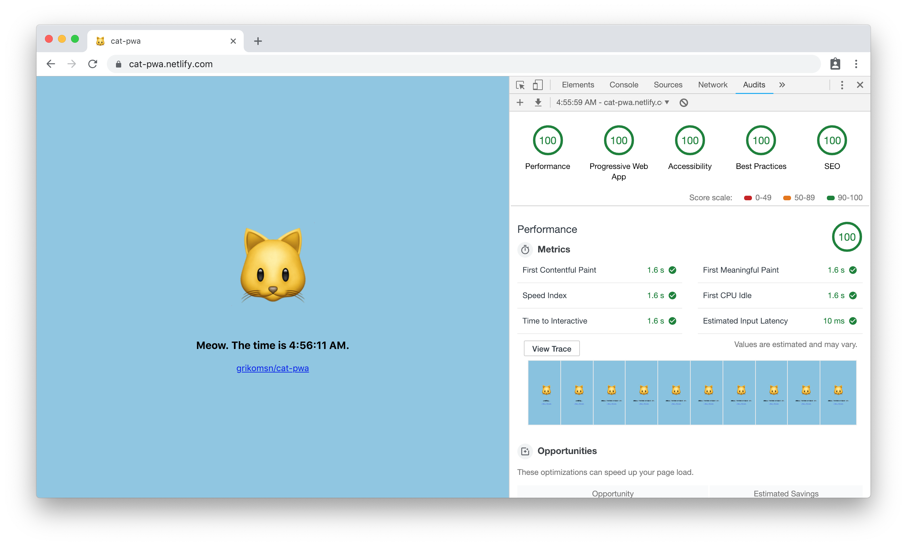

# cat-pwa

Testing service workers with [Parcel bundler][1],  
deployed on [cat-pwa.netlify.com](https://cat-pwa.netlify.com)
and [cat-pwa.now.sh](https://cat-pwa.now.sh)

 

## Project purpose

- Learning and experimenting service workers
- Using service worker with Parcel
- Also preparing for a meetup ✨

## Packages used

- [parcel-bundler/parcel][1]
- [qinshixixing/parcel-plugin-clean-dist][2]
- [cyyyu/parcel-plugin-sw-precache][3]

## Development

- Clone the project
- Install dependencies using `yarn`
- Edit contents on `public` directory
- Run development server using `yarn dev`

## Publishing

- Export for deployment using `yarn build`
- Deploy the `dist` directory

## Deployment configurations

- If deploying to [Zeit Now](https://zeit.co/now), configure `now.json` with
  preferred alias and options

- If deploying to [Netlify](https://www.netlify.com/), set these values on the
  dashboard:
  - Build command: `yarn build`
  - Publish directory: `dist`

[1]: https://github.com/parcel-bundler/parcel
[2]: https://github.com/qinshixixing/parcel-plugin-clean-dist
[3]: https://github.com/cyyyu/parcel-plugin-sw-precache

## Assets and other tools

- [Emojipedia Cat Face (Apple)](https://emojipedia.org/cat-face)
- [Web App Manifest Generator](https://app-manifest.firebaseapp.com)

## License

MIT
